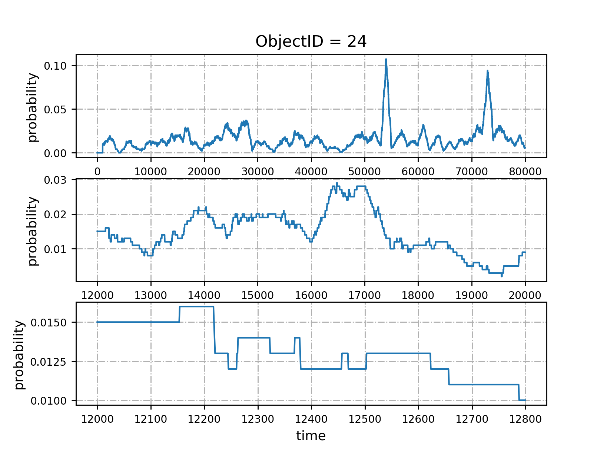

# materials_zhu

_for DeepCache paper_

### 1. papers
[DeepCache(2018NetAI)](https://dl.acm.org/citation.cfm?id=3229555)

### 2. tutorials_of_codes/
    - seq2seq_master/

[seq2seq-tensorflow-google](https://github.com/google/seq2seq)

    - tensorflow_seq2seq_tutorials_master/

[seq2seq-tensorflow-ematvey](https://github.com/ematvey/tensorflow-seq2seq-tutorials)

### 3. codes/
    - .py
    - readme.md

### 4. dataset1

**dataset1_v1**:  生成了一个二维数组，6*20000大小的。因为论文中zipf分布给了6个不同参数。所以访问序列就是每一个给定的参数产生20000次访问，然后参数变化，再访问20000次这样

**dataset1_v2**:  (80, 1000)  [采用蒙特卡罗方法生成zipf分布随机数据](https://www.jianshu.com/p/c35a0916a872)


 **dataset1_v3**:  (80, 1000)  [生成Zipf分发的随机数](http://landcareweb.com/questions/25789/sheng-cheng-zipffen-fa-de-sui-ji-shu)-   我修改了程序重新产生了训练集，每个interval的request次数为1000，β是6个值中随机的一个，object的流行度也是随机的。一共有80个interval，共80K次访问。

### 5. dataset1_appended

从**dataset_v3**80K长的请求序列(80, 1000)开始构造：首先reshape为(80K, )；然后开始统计1000内访问序列的信息，如统计0到999计算得到 $X_{999}$，计算1到1000计算得到 $X_{1000}$，直到计算19到1198得到 $X_{1198}$,这样形成第一个 **Input**= $[X_{999}, X_{1000}, X_{1198}]$；将上述$X_i$的计算过程继续下去可以得到 $X_{1199}$, $X_{1200}$, $X_{1298}$ , ...，将 $[X_{1199}, X_{1200}, X_{1298}]$ 作为第一个**Output**(这样构造的序列是有规律可学嘛？)。显然有如下：

$$X_t.shape = (ObjectNum, ), t=999, ...$$

$$\sum_{i}^{ObjectNum}X_{t, i} = 1$$

实际上 $X_{t, i}$ 表示时刻 $t$ 之前1000时间窗口大小内 $ObjectID=i$ 被请求的频率。下面给出 $X_{?, i}$ 在时间上的变化规律:


(balabala...)

**dataset1_appended_v1**(80K, 1+5)：1代表`the actual object request`, 5代表`the fake ones (Top5)`。在dataset1_appended_v1的构造中，对于当前时刻 $t$，假设我们已知未来 $t+M$时刻内(即 $t+1, t+2,..., t+M$)对应的 $X_{t+1}, X_{t+2},..., X_{t+M}$ ；当 $M=1$时，我们只要选取 $X_{t+1}$概率向量中最大的前5所对应的Object的ID，按大小 **逆序**加在当前时刻的

`the actual object request`，形成 `the fake ones (Top5)`。**说明** 由于预测输出 **Output**　从 $[X_{1199}, X_{1200}, X_{1298}]$ 开始，所以之前无法构造 `the fake ones (Top5)`，我们在对应的位置填无意义的`-1`。**dataset1_appended_v1** 见 'dataComputed/dataset1_appended_v1.npz'
```python
res = np.load('dataComputed/dataset1_appended_v1.npz')
requests = res['requests']
# requests.shape = (80000, 6)
```


**dataset1_appended_v2** 思考中，实际上 $M \neq 1$，那么如何 **有效利用多步预测的结果**, 另外每个`the actual object request`都跟一个序列`the fake ones (Top5)`是否过于频繁，毕竟dataset1的cache=5。


### Notes

**命中率计算** 不考虑 `the fake ones (Top5)`带来的miss(虽然也会带来开销)

---
_END OF FILE_
